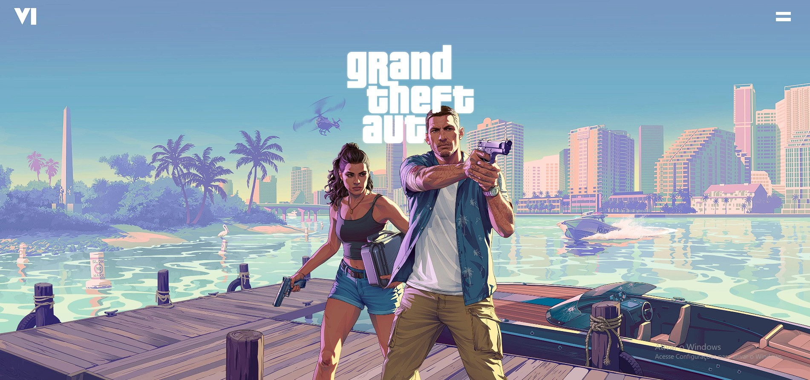
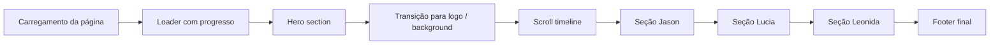

# GTA VI — Landing Page inspirada no visual promocional da Rockstar, focado na biblioteca GSAP

<div align="center">



</div>

<div align="center">
  
  
  
  
</div>

Uma landing page moderna e cinematográfica inspirada na estética visual do site promocional de [Grand Theft Auto VI - Rockstar Games](https://www.rockstargames.com/VI/only-in-leonida), desenvolvida como estudo pessoal de front-end, interação, storytelling visual, motion design com o [GSAP](https://gsap.com/).

> Este projeto é uma recriação estilizada para fins de aprendizado e prática pessoal, sem vínculo oficial com a Rockstar Games ou com a marca GTA VI.

---

## Sobre o projeto

Este projeto foi construído para explorar técnicas avançadas de animação web, especialmente com GSAP, em uma página que simula a experiência de uma campanha digital premium. O foco principal foi criar uma narrativa visual rica através de:

- seções longas com scroll cinematográfico;
- transições suaves entre blocos de conteúdo;
- overlays, brilho, contraste e composição visual;
- uso de vídeos e frames em sequência;
- navegação com destaque de seção ativa;
- carregamento inicial com barra de progresso.

A ideia não é copiar o site oficial, mas estudar a linguagem visual e a dinâmica de apresentação que o projeto da Rockstar usa para criar uma sensação de impacte, atmosfera e imersão.

---

## Objetivo do projeto

O objetivo principal deste repositório é:

- praticar desenvolvimento front-end moderno;
- dominar scroll-driven animations com GSAP;
- experimentar layouts de landing pages premium;
- entender performance, carregamento de assets e responsividade;
- criar uma base visual forte para estudos pessoais de UI/UX e motion design.

---

## Como o GSAP foi usado

O GSAP foi a ferramenta principal do projeto. Ele foi usado para controlar praticamente todas as animações visuais, especialmente em cenários como:

- transição da primeira seção de abertura;
- fade e deslocamento das seções em scroll;
- animação paralaxe de conteúdo e imagens;
- avanço de vídeos conforme a página avança;
- sincronização entre timeline e navegação;
- efeitos de entrada e saída em elementos do layout.

### Exemplo da lógica principal

O projeto registra o plugin `ScrollTrigger` e cria uma timeline principal:

```javascript
gsap.registerPlugin(ScrollTrigger);

const tlDesktop = gsap.timeline({
    scrollTrigger: {
        trigger: ".containerPai",
        start: "top top",
        end: "+=15000",
        scrub: 1,
        pin: true,
        invalidateOnRefresh: true,
    },
});
```

Essa timeline percorre o layout como se fosse uma história em movimento, conectando cada seção com um momento específico do scroll.

### Fluxo de animação



O GSAP foi usado para sincronizar visual e movimento, de modo que cada elemento parece evoluir em conjunto com a jornada do usuário pela página.

---

## Animações implementadas

### 1. Hero e abertura

A seção inicial usa hidratado de elementos e transições de opacidade e escala para criar uma entrada dramática.

### 2. Scroll storytelling

Com `ScrollTrigger`, as seções são animadas conforme o usuário desce a página. Isso gera a sensação de uma narrativa em movimento, similar a campanhas online premium.

### 3. Parallax e deslocamento em camadas

Elementos como imagens e blocos de texto recebem movimento diferente em profundidade, reforçando a camada visual e criando profundidade realista.

### 4. Vídeos e frames

Os vídeos foram integrados com animações de `currentTime` e troca de frames para produzir uma convivência dinâmica entre vídeo e composição estática.

### 5. Loader e carregamento de assets

Antes da experiência principal, o projeto mostra um loader com barra de progresso para simular a preparação da página e aprimorar a percepção de qualidade.

---

## Estrutura do projeto

```text
GTA_VI_Copia/
├── index.html
├── style.css
├── script.js
├── README.md
├── img/
├── video/
├── frames/
├── docs/
├── outros/
└── fonts/
```

### Arquivos principais

- `index.html`: estrutura base da landing page
- `style.css`: visual, layout, responsividade, styling geral
- `script.js`: lógica de animações com GSAP e ScrollTrigger

---

## Como executar localmente

Como é um projeto estático, a forma mais simples de rodar é via um servidor local.

### Opção 1 — Python

```bash
python -m http.server 8000
```

Depois acesse:

```text
http://localhost:8000
```

### Opção 2 — VS Code Live Server

Se você usa a extensão Live Server, basta abrir a pasta e iniciar o servidor no arquivo `index.html`.

---

## Estilo visual

A página foi pensada como uma experiência de marketing premium, com:

- fundo escuro e alto contraste;
- tipografia forte e impactante;
- destaque para personagens e narrativa;
- efeitos de brilho, blur, escala e movimento;
- interface minimalista porém cinematográfica.

Esse tipo de abordagem foi estudado para entender como motion design e UI se combinam para construir identidade visual e presença de marca.

---

## O que aprendi com este projeto

Este estudo ajudou a desenvolver habilidades em:

- GSAP e timelines complexas;
- ScrollTrigger e sincronização visual;
- organização de assets e pré-carregamento;
- responsividade em layouts cinematográficos;
- criação de experiências visuais profissionais em HTML/CSS/JS;
- reforço de boas práticas em front-end moderno.

---

## Observação importante

Este projeto foi criado para fins de estudo pessoal e prática de desenvolvimento front-end. Ele busca analisar e reproduzir a linguagem visual de uma campanha digital premium, inspirada no universo e na estética do jogo GTA VI.

Ele não substitui o material oficial da Rockstar Games e não tem objetivo de representar um produto comercial ou oficial da empresa.

---

## Visão pessoal

Além de ser uma página visualmente impactante, este projeto representa um exercício de design e programação em que a animação deixa a experiência mais envolvente. O diferencial principal está na forma como elementos estáticos e dinâmicos se combinam para transmitir narrativa, tensão e qualidade premium.

---

## Créditos e referências

- Inspirado visualmente na estética de campanhas promocionais do [GTA VI](https://www.rockstargames.com/VI/only-in-leonida);
- Utilização da biblioteca [GSAP](https://gsap.com/) para animações;
- Estudo pessoal de front-end, motion design e storytelling visual.

Se você também está estudando animação web, esse projeto pode servir como referência prática para entender como criar experiências de scroll mais envolventes e cinematográficas.
